# Чат с персонажем

Основой CAICHAT.AI являются чаты. Здесь можно разговаривать с персонажами, пробовать ролевые игры любого формата (SFW и NSFW) и погружаться в глубокие диалоги.

## Начать чат

Чтобы начать чат перейдите в профиль выбранного персонажа и нажмите кнопку `Начать чат` под его именем. Откроется чат, в котором вы увидите приветсвие. Ответьте на него и приключение начнется.

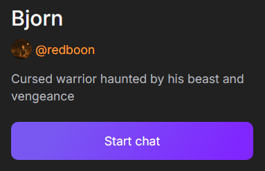{.on-glb data-gallery="only-dark"}

### Необязательные настройки перед началом чата

Перед тем как начать чат, можно настроить его под свои предпочтения. Находясь в профиле персонажа вы можете:

- Выбрать начальное сообщение (если автор предоставил такой выбор). Оно повлиет на дальнейшее повестование.
- Персону, от лица которой вы будете вести диалог.
- AI-модель которая будет генерировать сюжет и сообщения персонажа.
- Промпт на сонове которого будет работать выбранная ранее AI-модель.

!!! note

	Все, кроме начального сообщения можно будет изменить находясь в чате.

## Шифрование чата

Вы можете зашифровать свои сообщения и чаты сквозным шифрованием. Третьи лица, включая CAICHAT.AI, не смогут прочитать ваши сообщения. Для этого в правом меню сайта нажмите на иконку замка под аватаром персонажа и введите пароль, чтобы зашифровать текущий чат.

!!! warning

	Если вы забудете пароль, доступ к зашифрованным чатам будет потерян навсегда. Сохраните его в надёжном месте.

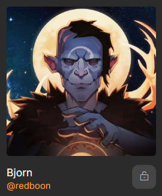{.on-glb data-gallery="only-dark"}

## Продолжить чат

Если вы хотите продолжить чат, который начали ранее, перейдите в разде `Чаты` находящийся в правом меню сайта. В нем будут показаны все персонажи с которыми вы начинали чаты. Возле персонажа есть список персон от лица которых вы вели диалоги. Нажмите на нужную, чтобы посмотреть последнее сообщение и время его отправки. Нажмите кнопку `Продолжить`, чтобы открыть выбранный чат.

Здесь вы можете удалить чат, нажав кнопку `Удалить` или создать новый.

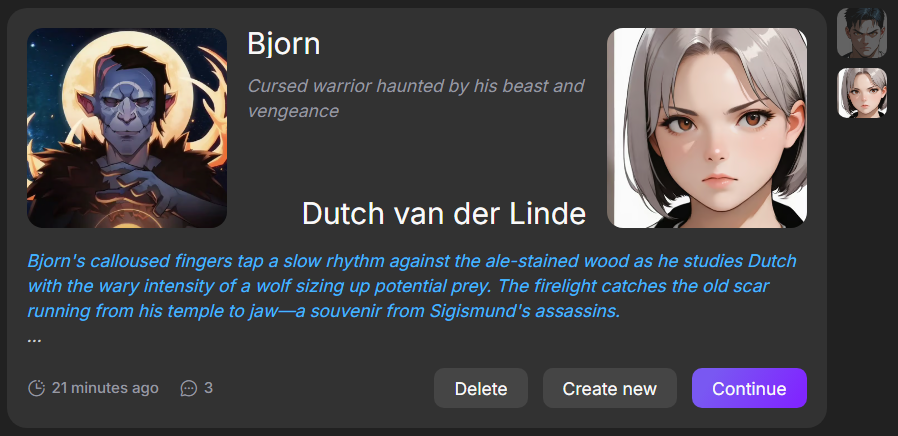{.on-glb data-gallery="only-dark"}

## Действия персоны

Вы можете не только говорить, но и выпонять действия. Для этого в начале и конце добавьте звездочку (*).

Используя звездочки, вы можете описывать не только действия, но и окружающую обстановку и происходящие вокруг вас события.

!!! note

	Пример: \*Ваше действие или описание события.\*

## Генерация подсказок

Если вы не знаете как дальше продолжить диалог - воспользуйтесь подсказкой. Для этого нажмите на кнопку с изображением карандаша справа от поля ввода сообщения. Нажав на одну из подсказок она появится в поле ввода.

Повторное нажатие на эту кнопку сделает подсказку более развернутой.

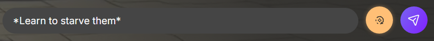{.on-glb data-gallery="only-dark"}
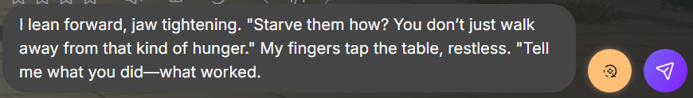{.on-glb data-gallery="only-dark"}

## Перегенерация сообщения

Если вам не нравится ответ персонажа и хочется получить другой - используйте кнопку перегенерации. Она находится под сообщением персонажа. Вы можете сгенерировать несколько ответов и выбрать какой из них больше вам подходит.

Переключаться между сообщениями можно с помощью стрелок находящихся справа от кнопки перегенерации.

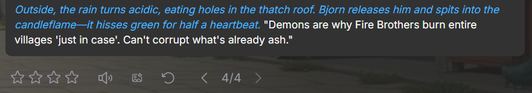{.on-glb data-gallery="only-dark"}

## Редактирование сообщения

Чтобы направить сюжет в нужную сторону, воспользуйтесь функцией редактирования сообщения и напишите ответ который должен сказать персонаж. Для этого нажмите на три точки справа вверху над сообщением и выберите пункт `Edit`.

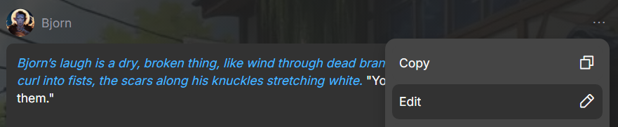{.on-glb data-gallery="only-dark"}

## Продолжение диалога

Вы можете нажать кнопку отправки сообщения не вводя текст. Персонаж сам продолжит диалог и начнет развивать сюжет без вашего участия.

!!! warning

	Создание слишком большого количества сообщений без ввода ответа может привести к повторению ответов.

## Изображения для разговора

События из диалога можно визуализировать с помощью генератора изображений. Они создаются на основе авата и нескольких последний сообщений в чате. Для этого нажмите на иконку картинки под сообщением персонажа.

Если результат вас не устраивает, нажмите на иконку перегенерации под изображением, чтобы создать новый вариант.

## Клонирование чата

Вы можете клонировать чат с выбранного сообщения. Это позволит вам продолжить диалог в любом направлении не меняя исходный диалог. Для этого нажмите на три точки над сообщением и выберите пункт `New chat from here`. Это создаст новый чат с отправленными сообщениями включя выбранное.

Клонированный чат появится в списке всех чатов с этим персонажем.

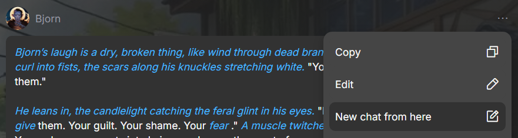{.on-glb data-gallery="only-dark"}

## Оценка сообщений

Вы можете оценить качество любого ответа с помощью пяти звёздочек слева внизу под сообщением. Это помогает нам получать обратную связь о работе ИИ и улучшать его.

Оценка никак не повлияет на вашу переписку, но если ответ показался вам особенно удачным или неудачным — поставьте оценку.

## Сообщить о ненадлежащем ответе

Если вы считаете, что сообщение персонажа является неуместным, оскорбительным или нарушает правила сообщества, сообщите нам об это. Нажмите на три точки справа над сообщением и выберите пункт `Complain`. В появившемся окне выберите причину из предложенного списка и опишите проблему.

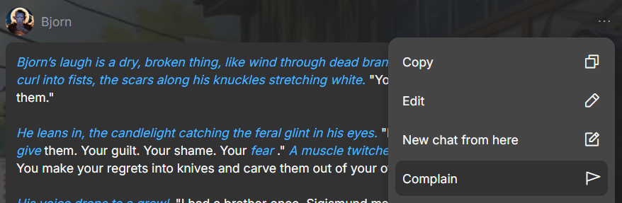{.on-glb data-gallery="only-dark"}

## Изменение персоны

Вы можете изменить своё имя, аватар и даже информацию о себе, сменив персону. Для этого в правом меню сайта нажмите на пункт `Персоны`. В открывшемся окне вы сможете выбрать любую из созданных вами персон.

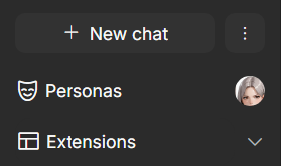{.on-glb data-gallery="only-dark"}

## Воспоминания

С помощью менеджера памяти вы можете управлять воспоминаниями персонажа: добавлять новые, удалять или редактировать существующие. Это могут быть факты из прошлого, детали взаимодействия с вами или любые придуманные элементы.

- Чтобы включить `Воспоминания` - в правом меню сайта нажмите на пункт `Расширения` и в появившемся меню активируйте переключатель напртив пункта `Воспоминания`.
- Чтобы открыть менеджера памяти нажмите на сам пункт `Воспоминания`.

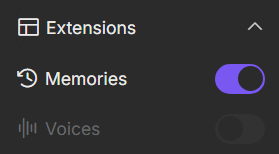{.on-glb data-gallery="only-dark"}

Закреплённое воспоминание постоянно учитывается персонажем при создании ответов и влияет на его поведение. Чтобы закрепить воспоминание, нажмите на три точки справа от него и выберите `Закрепить воспоминание` в выпадающем меню. Аналогично, его можно открепить.

## Выбрать модель ИИ и готовый промт для общения в чате

Вы можете создать предустановленную модель ИИ с заранее настроенной системной подсказкой. Это позволяет быстро применять определённый стиль поведения и речи персонажа без необходимости вручную настраивать каждый параметр.

Для этого в правом меню сайта нажмите на пункт `Создать пресет`. В первом окне выберите AI-модель и нажмите `Продолжить`. Во втором окне выберите подходящий промпт и нажмите `Сохранить`.

Вы можете в любой момент менять настройки настройки пресетов и переключаться между ними.

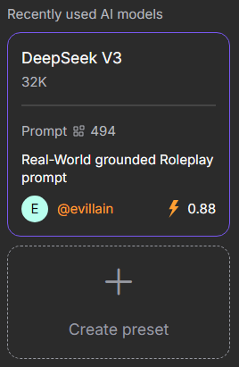{.on-glb data-gallery="only-dark"}