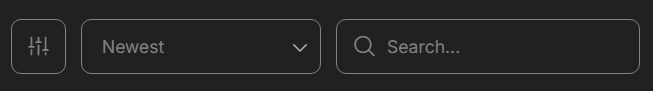
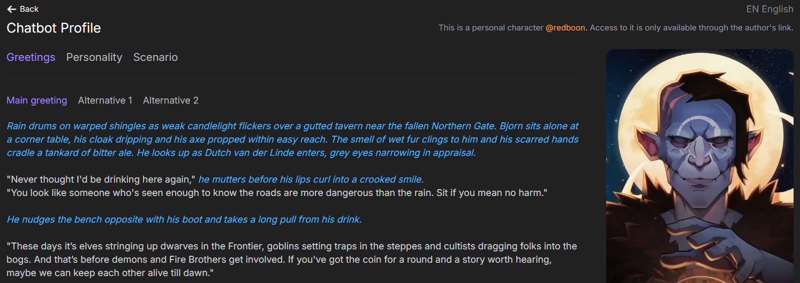
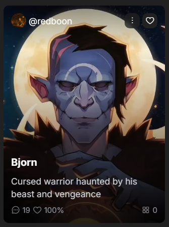

# Characters Catalog

На CAICHAT.AI собрано огромное количество уникальных персонажей, созданных пользователями со всего мира! Любите непринужденное общение? Или предпочитаете захватывающие ролевые сцены и даже немного откровенности? Здесь есть всё.

Не нашли то, что нравится? Создавайте собственных героев, показывайте их сообществу и зарабатывайте на этом или сохраните их только для себя. CAICHAT.AI — пространство без ограничений для вашей фантазии.

## Filters

Для поиска интересных вам персонажей воспользуйтесь фильтрами. Для этого перейдите в каталог персонажей и нажмите на иконку расположенную слева вверху.

{.on-glb data-gallery="only-dark"}

Фильтровать пресонажей можно по:

- Тегам - выберите теги которые вы хотите видеть в каталоге и исключите те которые вам не интересны.
- NSFW - отключите переключатель, чтобы в каталоге появились персонажи для взрослых.

Персонажей можно отсортировать по:

- Новизне.
- Популярности.
- Количеству чатов.
- Количеству лайков.

Или воспользуйтесь поиском, чтобы найти конкретного персонажа по имени или описанию.

## Профиль персонажа

В каталоге на карточке персонажа отображается краткая информация - username автора, имя персонажа, описание, количество чатов и рейтинг.

Чтобы посмотреть полную информацию перейдите в профиль персонажа. Для этого нажмите на его карточку.

В профиле персонажа можно прочитать полное описание, варианты приветствий с которых будут начинаться чаты, информацию о его личности, сценарий по которому пойдет история и заметку автора. Так же вы можете оценить персонажа, добавить в избранное, поделиться им с друзьями, отправить жалобу или заблокировать автора.

Если персонаж прописан на нескольких языках то в правом верхнем углу вы можете выбрать подходящий для вас язык.

Если хотите посмотреть всех персонажей, созданных этим автором - нажмите на его username.

{.on-glb data-gallery="only-dark"}

## Избранное

Чтобы не потерять любимых персонажей - добавьте их в `Favorites`. Для этого нажмите на иконку сердца в верхнем правом углу карточки персонажа. Так же это можно сделать на странице персонажа или в чате с ним.

Чтобы посмотреть всех избранных персонажей перейдите в разде `Favorites`. Ссылка на него находится в левом меню сайта.

{.on-glb data-gallery="only-dark"}

## Обмен персонажами

Вы можете поделиться интересным персонажем с друзьями через мессенджеры или социальные сети. Для это на карточке персонажа нажмите на три точки в верхнем правом углу и в появившемся меню выберите пункт `Sahre`.

Теперь вы можете выбрать один из предложенных мессенджеров или скопировать ссылку и отправить ее в любое приложение или сайт.

## Сообщить о персонаже

Если вы нашли пресонажа который, по вашему мнению, нарушает правила сообщества - сообщите об этом нам. Для это на карточке персонажа нажмите на три точки в верхнем правом углу и в появившемся меню выберите пункт `Report`. В появившемся окне отметьте пункты которые может нарушать выбранный персонаж и при желании заполните поле `Additional details`.

Модераторы рассмотрят ваше обращение и примут соответствующие меры.

## Блокировка атворов

Если вы заблокируете автора - его персонажи будут скрыты из каталога и избранного. Сделать это можно нажав на три точки в верхнем правом углу карточки персонажа и в появившемся меню выберите пункт `Block creator` и подтвердив действие в появившемся окне.

Чтобы разблокировать автора - перейдите в раздел `Blocked Creators` в левом меню сайта и нажмите на кнопку `Unblock` на против нужного автора.

Заблокировать и разблокировать автора можно на его публичной странице.