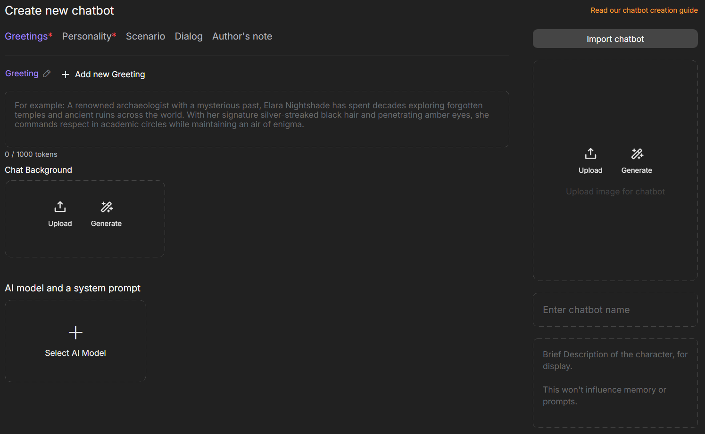
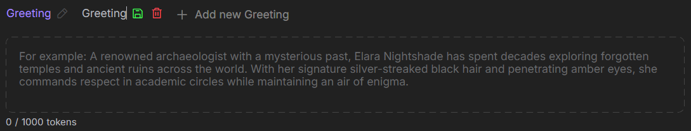
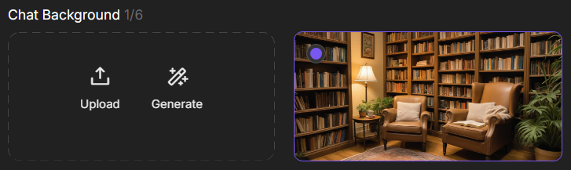
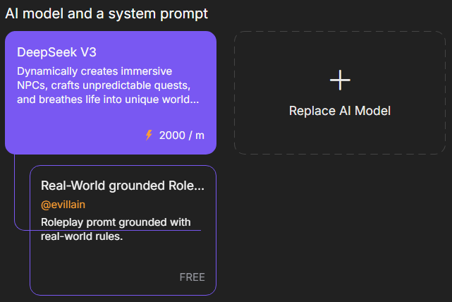
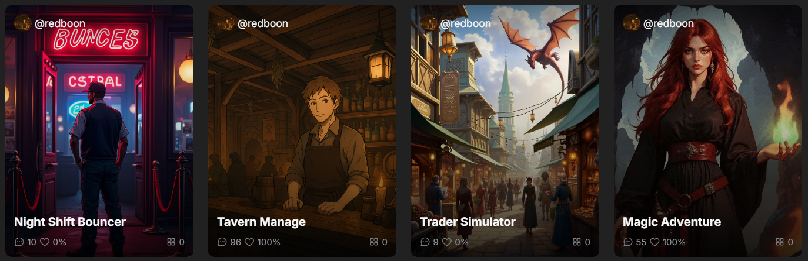
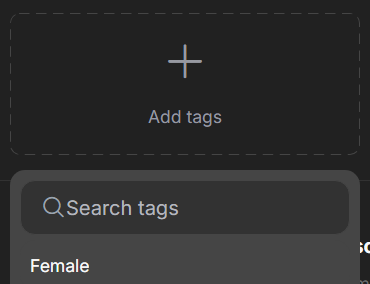

# Creating Chatbots

On CAICHAT.AI, you can create your own chatbot and bring your boldest ideas to life. Appearance, speech, and behavior are entirely under your control, allowing the character to fully match your vision. Simply open the `Create Chatbot` section and fill in the required fields step by step to shape a unique personality.

{.on-glb data-gallery="only-dark"}

## Greeting

A greeting is the character’s first message, setting the tone for the conversation. It helps the user understand the character’s personality or role and creates a first impression.

You can create multiple greetings in different languages, giving users a choice when starting a chat. To do this, click `Add new Greeting`.

Each greeting can have its own title. Click the pencil icon next to it, enter a short, descriptive name, and then click the save or delete icon.

{.on-glb data-gallery="only-dark"}

!!! note

	Use the variable `{{user}}` to address the user. For example, if the user’s name is Judy Alvarez, the message `"Hello, {{user}}!"` will appear as `"Hello, Judy Alvarez!"`.

!!! warning

	This field is required.

### Chat Background

The chat background allows you to set a unique background image for each character greeting. This helps create atmosphere and makes each introduction more engaging and visually appealing.

You can upload an image from your device or generate one using an AI model. You can add up to 6 images.

{.on-glb data-gallery="only-dark"}

To attach an image to a specific greeting, select that Greeting and click on the desired image. A checkmark will appear in the top-left corner of the image, confirming your selection.

{.on-glb data-gallery="only-dark"}

## Personality

Personality is the foundation of your character. Here, you define their traits, speech style, and behavior. These details make your chatbot unique and recognizable.

Describe the character’s personality, traits, background, manner of speaking, etc. Use clear and concise language. Examples: “witty and sarcastic,” “always speaks in rhymes,” “afraid of spiders,” “former detective haunted by the past.”

!!! warning

	This field is required.

## Scenario

The scenario sets the foundation for interacting with the character. Here, you define the context, world, or situation in which the conversation takes place. The scenario helps create atmosphere and guides the direction of the dialogue.

## Dialog

A dialog example demonstrates how your character communicates in practice.

Add sample lines for the character in different situations—such as when they are excited, angry, or in danger. The more examples you provide, the more accurately the AI can replicate their style of communication.

!!! note

	Example of Dialogue Formatting:

		User: Hello there
		Character: [character's response]

## Author's Note

The author’s note allows you to add additional explanations about the character. Here, you can share ideas, personality traits, or context that helps better understand your chatbot.

## AI Model and System Prompt

Select an AI model and configure the system prompt to define your character’s behavior and style. The model processes requests, while the prompt determines how the character responds, creating a unique experience. The chosen model and prompt are set by default, but users can select others.

{.on-glb data-gallery="only-dark"}

## Avatar

A character’s avatar is their visual “business card” on CAICHAT.AI. Users see it even before starting a conversation. You can create an avatar using the image generator or upload your own photo. A bright and interesting avatar makes the character more lively and memorable.

{.on-glb data-gallery="only-dark"}

### Generate Avatar

To generate an avatar, choose one of the available models: Realistic Vision for realistic images, Anime SDXL for anime style, or Background to create a background image.

Enter a prompt—a text description of the character’s appearance, style, mood, or environmental details.

{.on-glb data-gallery="only-dark"}

## Name

The name defines your character’s identity and influences how they are perceived in chats. It is visible to other users if the character is public. Choose a name that fits the character’s personality, role, and backstory.

If the character’s personality is not fully described, the name plays a significant role in shaping behavior. Using the names of celebrities may prompt the AI to adopt their speech style and traits.

## Description

This is a brief description of the character for reference. It gives users a quick overview and does not affect the memory or system prompt.

## Gender and Visibility

Choose the character’s gender and set their visibility in the catalog. Visibility settings determine whether other users can access the character.

## Tags

Tags act as keywords that reflect the character’s personality, roleplay style, and theme. They help CAICHAT.AI filter and find characters that match users’ interests.

Use only accurate tags so users can understand the character’s traits and style. Misleading tags may lead to complaints and the chatbot being blocked.

To select tags, click the `Add tags` field located below the `Create chatbot` button.

{.on-glb data-gallery="only-dark"}

## Create Chatbot

Before creating a character, make sure to read the community guidelines and check the box `I have read and agree with the Community Guidelines`.

Click the `Create chatbot` button. If all required fields are filled out correctly, the character will be created and appear in the `My Chatbots` section.

{.on-glb data-gallery="only-dark"}