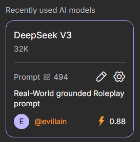

# Generation Settings

Generation settings allow you to control the creativity of responses, the AI model used, and the number of tokens. You can adjust these parameters during a conversation to tailor the character’s behavior.

To change settings in a chat, click the gear icon next to the selected AI model and prompt in the site’s right-hand menu.

{.on-glb data-gallery="only-dark"}

!!! note

	Settings may vary depending on the selected AI model.

## Generation Settings

Generation Settings allow you to manage additional variables that affect the style and content of the character’s responses.

### Temperature

The Temperature parameter determines how predictable or creative a character’s responses will be. The default value is 0.7 and it can be set from 0 to 2.

A low temperature makes responses cautious, consistent, and clear—ideal for focused conversations. A high temperature makes characters more adventurous, generating diverse and creative responses that can be entertaining but less precise.

### Total Context Tokens

The Total Context Tokens parameter shows how many tokens are used for the entire chat context. It includes all messages and character responses, helping you monitor token usage and maintain the conversation.

### Max Response Tokens

This setting allows you to adjust the number of tokens for a character’s responses. Limits depend on the selected model. A higher limit does not guarantee longer responses—the character may reply briefly depending on the context.

### TOP-P

Top-P controls the character’s word selection. Low values make responses stable and predictable, while high values make them more creative and unexpected. The default is 0.7, and it can be set from 0 to 1.

### Presence and Frequency Penalty

Presence Penalty and Frequency Penalty are settings that influence the diversity of a character’s responses.

- Presence Penalty reduces the likelihood of the character reusing words or topics that have already appeared. Higher values encourage new ideas and vocabulary in responses.
- Frequency Penalty limits the repetition of the same words or phrases within a single response. Higher values make responses more varied and natural, reducing redundancy.

These parameters help balance dialogue consistency with the character’s creativity. The default is 0.2, and they can be set from 0 to 2.