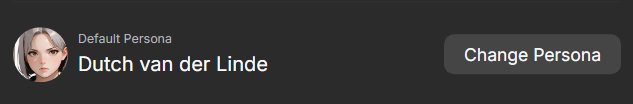
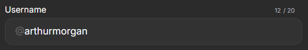
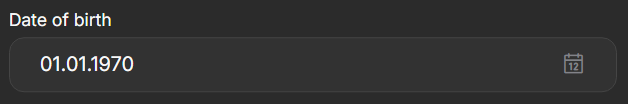
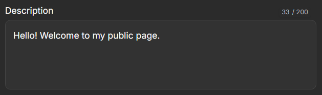

# Настройки профиля

В личном профиле вы можете менять уникальный username, информацию о себе, тему оформления сайта, выключить фильтр NSFW. Чтобы перейти к настройкам нажмите на свой ник в верхнем левом углу, а затем нажмите на кнопку `Настройки`.

## Персонаж по умолчанию

Это персона от лица которой будет вестись диалог с персонажем. При создании чата или во время диалога с персонажем вы можете изменить персону на любую другую.

{.on-glb data-gallery="only-dark"}

## Имя пользователя

Это ваш уникальный идентификатор на сайте. Его будут видить пользователи сайта на вашей публичной странице, в описании созданных вами ботах и промптах.

{.on-glb data-gallery="only-dark"}

## Дата рождения

Укажите дату рождения, чтобы получить возможность выключить фильтр NSFW-контента.

{.on-glb data-gallery="only-dark"}

## Описание

Это короткое описание будет отбражаться на вашей публичной странице для всех пользователей.

{.on-glb data-gallery="only-dark"}

## NSFW-фильтр и тема оформления

В разделе `Настройки` вы можете выбрать светлую или темную тему для сайта, а так же включить или выключить NSFW-фильтр.

{.on-glb data-gallery="only-dark"}