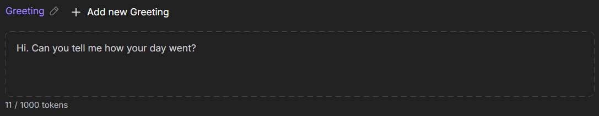

# Токены

Токены делят текст на блоки для чтения сообщений, отображения персонажей и генерации ответов. Каждый ваш ввод и ответ персонажа использует токены.

Количество токенов, к которым вы имеете доступ, зависит от используемой вами модели ИИ и уровня подписки, на который вы подписаны.

Доступное количество токенов зависит от выбранной модели ИИ и вашего уровня подписки.

## Как токены влияют на ответы

Персонажи используют токены для формирования ответов на ваши сообщения. Чем больше токенов, тем длиннее и детальнее могут быть их ответы. Если лимит превышен, ответ будет обрезан.

Каждое слово, часть слова, символ и смайлик учитываются как токены. При ограниченном бюджете токенов персонаж будет отвечать короче и проще. В длинных разговорах персонажи могут «забывать» предыдущие части чата, чтобы уложиться в лимит.

Количество токенов за ответ зависит от ваших настроек и уровня подписки. Вы можете изменить лимит токенов для персонажей в настройках генерации.

## Как токены влияют на создание персонажей

Следите за бюджетом токенов при создании персонажа: личность, сценарий, приветствие и примеры диалогов используют токены. Количество потраченных токенов отображается в счётчике под текстовым полем.

!!! note

	Используйте токены эффективно: делайте описание персонажа лаконичным, сосредотачивайтесь на ключевых деталях и обобщайте информацию, чтобы сохранять ясность.

{.on-glb data-gallery="only-dark"}

## Как токены влияют на память

Из-за лимита токенов персонаж может запоминать только часть истории сообщений. При небольшом бюджете токенов старые сообщения могут быть забыты, что влияет на поведение в длинных диалогах.

Контролируйте использование токенов при создании персонажей для лучшей согласованности их поведения.