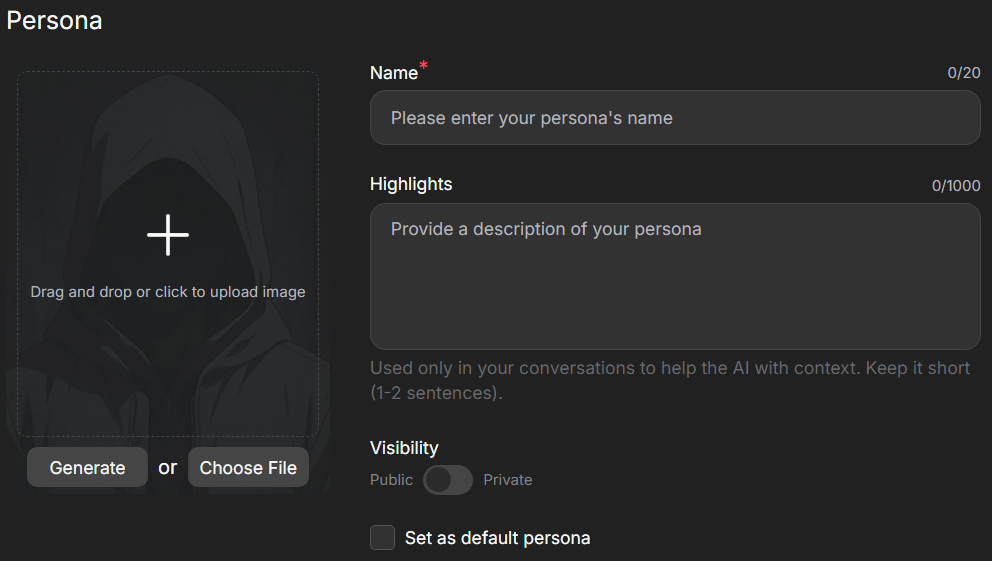
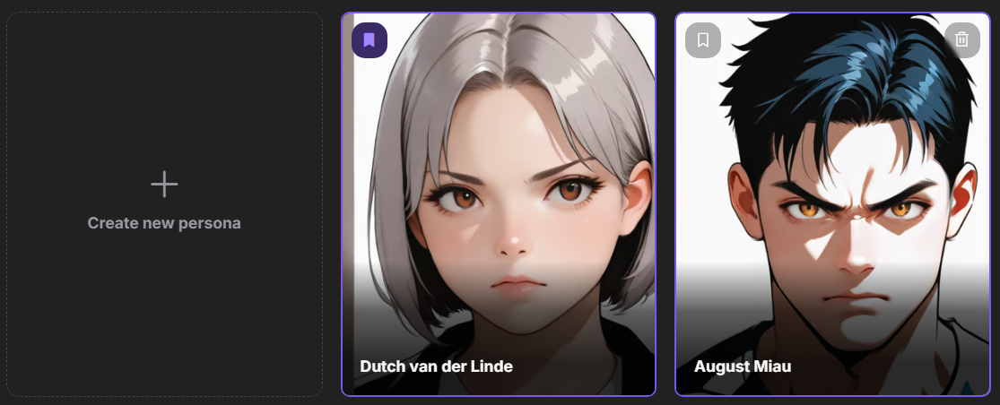

# User Personas

Unlock new possibilities for communication with personas. Create unique profiles and change your conversational style. Experiment with different roles and personalities to make your interactions one-of-a-kind.

## Creating a Persona

To create a persona, go to the `My Personas` section in the left-hand menu of the website and select `Create new persona`.

For each persona, you can generate or upload an avatar, assign a unique name, and describe its characteristics.

Key details may include style, mood, appearance, or role. One or two sentences are often enough to ensure characters accurately reflect your persona.

{.on-glb data-gallery="only-dark"}

## Managing Personas

You can add, delete, edit, and set default personas in the `My Personas` section.

When you start a new chat with a character, you will be prompted to choose the persona you wish to use for that conversation. It can be changed at any time within an existing chat. The selected persona will be displayed in the character chat list within the `Chats` section.

{.on-glb data-gallery="only-dark"}